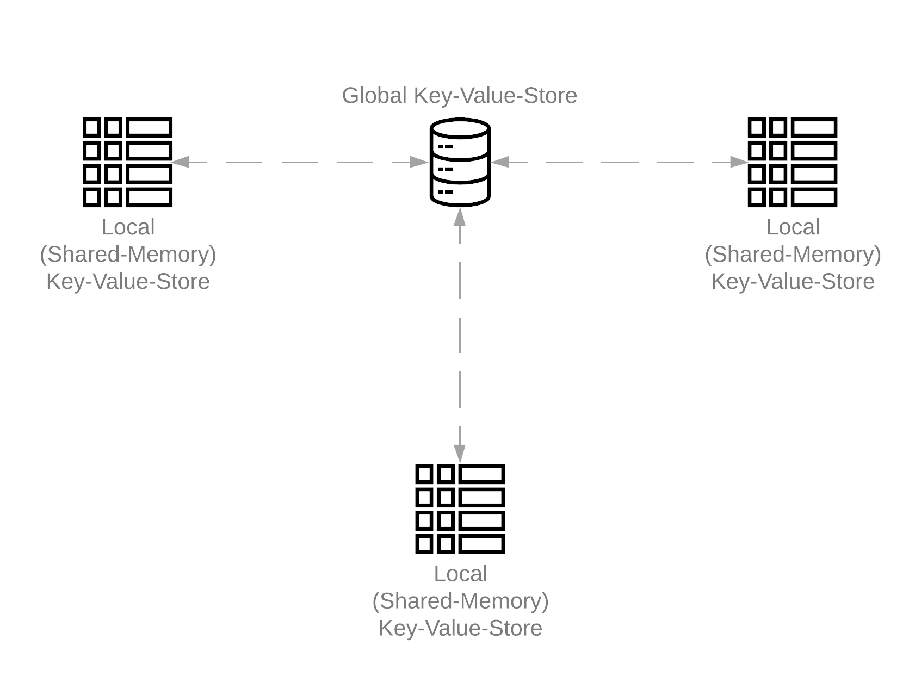

<p align="center"></p>

dstore is a distributed storage framework inspired from the [FAASM project](https://github.com/faasm).

## Database
Built as an in-memory datastore with dual layer architecture that enables the storage of Key-Value pairs on nodes in coherence with a single **'Global'** datastore for synchronization purposes. Keys are UIDs and should technically only be associated with **a** Value for eternity. Hopefully that will be implemented with the hash of said Value being used for the same.

## Architecture
<p align="center"></p>

The two layer architecture consists of an in-memory datastore on each node called **'Local'**, which stores copies of data-objects as Key-Value pairs where the Key acts as a UID and enables the user to have a single copy of the data on each node, thus decreasing network access to access the same.

## Demo
1. Download the code:
```bash
git clone https://github.com/vyuham/dstore
```
2. Run the server(ensure `cargo` is installed with [rustup](https://rustup.rs)):
```bash
cargo run --example global
```
Ensure the following is showing on the terminal:
```
Dstore server listening on 127.0.0.1:50051
```
3. On another terminal, start a client:
```bash
cargo run --example local
```
Ensure the following is showing on the terminal:
```
dstore v0.1.0 (addr: 127.0.0.1:50052)
This is an experimental database, do contribute to further developments at https://github.com/vyuham/dstore. 
Use `.exit` to exit the repl
db > 
```
Now you are ready to work with dstore :D

## Commands
- **SET:** The user/process can store data on the system using the `SET`/`PUT` command word, as shown below:
```
db> SET key value
```
The output `Database updated` implies that `key` now maps to `value` within dstore. When you try to `SET` a key that already exists in 'Local', expect to get the output:
```
Key occupied!
```
When a key exists only on 'Global' it is updated on local and the `SET` operation is abandoned, with the message:
```
(Updated local) Key occupied!
```
- **GET:** The user/process can access data from the system using the `GET`/`OUT` command word, as shown below:
```
db> GET key
```
This will output:
```
db: key -> value
```
The above output implies that `key` is mapped to `value` within dstore. If you try to `GET` a random key which isn't mapped to any value in the system, you will recieve the output:
```
Key-Value mapping doesn't exist
```
When you try to `GET` a key(say `hi`) that isn't available in 'Local' but exists in 'Global'(associated with a value `hello`), expect to receve the output:
```
global: hi -> hello     (Updating Local)
```
- **DEL:** The user/process can removes local as well as global
 copies of a Key-Value pair with the `DEL`/`REM` keyword as shown below:
```
db> DEL key
```
This might only remove the key-value mapping from within the current 'Local' and 'Global' while other 'Local's may still maintain a copy, discussion on how to reflect changes across all 'Local's needs to take place. To test these claims, please change the port number in 'example/local.rs` and try opening a few 'Local' clients, with a special port for each and do different order of tasks relating to deleting key-value pairs. 

## Contribution
Please consider opening an issue to discuss possible feature additions and use cases for the framework. We would love to review genuine PRs to fix bugs, solve issues and add feature, so do consider opening some!

As always, maintain decorum and follow the [rust-lang code of conduct](https://www.rust-lang.org/policies/code-of-conduct). Thank you!